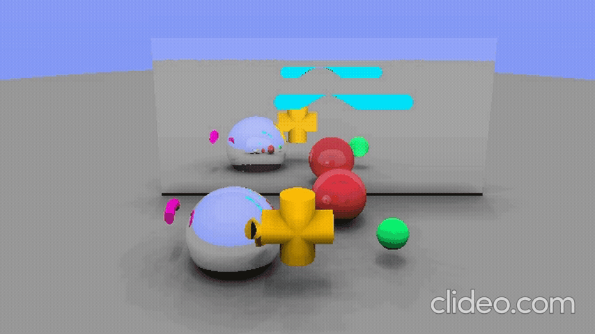

# Modélisation et Modélisation Avancée

Ce projet présente des techniques avancées de modélisation et de texturisation en GLSL, avec des effets de bruit pour créer des montagnes, du bois, et des objets 3D complexes. Les shaders incluent l’occlusion ambiante et des réflexions multiples et des volumes englobants pour des calculs plus rapides.
